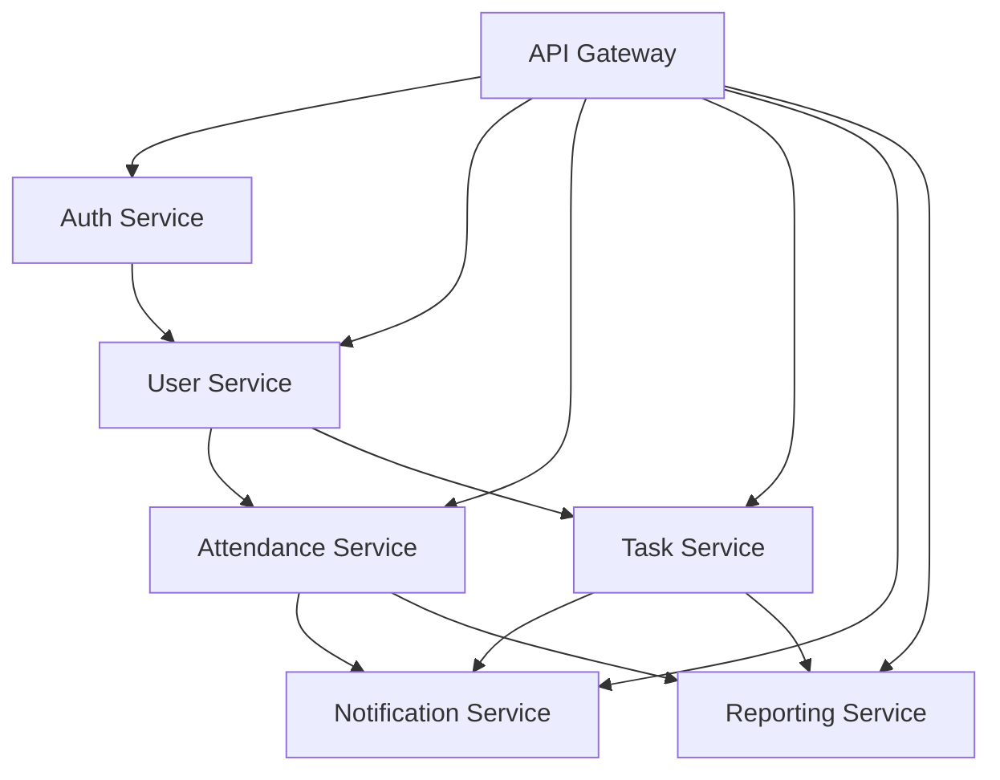

# Архитектура КПиУС

## Микросервисная архитектура

Проект построен на микросервисной архитектуре и состоит из следующих сервисов:

### 1. API Gateway (`services/api-gateway`)
- Маршрутизация запросов
- Аутентификация и авторизация
- Балансировка нагрузки
- Кэширование
- Ограничение скорости запросов

### 2. Auth Service (`services/auth-service`)
- Управление пользователями
- Аутентификация
- JWT токены
- Управление сессиями
- Восстановление пароля

### 3. User Service (`services/user-service`)
- Управление профилями пользователей
- Роли и права доступа
- Группы и подразделения
- Контактная информация
- Настройки пользователей

### 4. Attendance Service (`services/attendance-service`)
- Учет посещаемости
- Расписание занятий
- Статистика посещаемости
- Уведомления о пропусках
- Экспорт данных

### 5. Task Service (`services/task_service`)
- Управление заданиями
- Дедлайны
- Прогресс выполнения
- Оценки
- Комментарии и обсуждения

### 6. Notification Service (`services/notification-service`)
- Уведомления
- Почтовые рассылки
- Push-уведомления
- Шаблоны сообщений
- История уведомлений

### 7. Reporting Service (`services/reporting-service`)
- Генерация отчетов
- Аналитика
- Экспорт данных
- Статистика
- Визуализация данных

## Взаимодействие сервисов

## База данных

### MongoDB
- Основная база данных
- Репликация для отказоустойчивости
- Шардирование для масштабирования
- Индексы для оптимизации запросов

### Redis
- Кэширование
- Сессии
- Очереди сообщений
- Временные данные

## Мониторинг и логирование

### Prometheus + Grafana
- Мониторинг метрик
- Визуализация данных
- Оповещения
- Анализ производительности

### ELK Stack
- Централизованное логирование
- Анализ логов
- Поиск по логам
- Анализ ошибок

## Безопасность

### Аутентификация
- JWT токены
- Refresh токены
- Двухфакторная аутентификация
- OAuth2

### Авторизация
- RBAC (Role-Based Access Control)
- ACL (Access Control Lists)
- Политики доступа
- Аудит действий

### Защита данных
- Шифрование данных
- Защита от SQL-инъекций
- CSRF защита
- XSS защита

## Масштабирование

### Горизонтальное масштабирование
- Репликация сервисов
- Балансировка нагрузки
- Кэширование
- Шардирование данных

### Вертикальное масштабирование
- Оптимизация ресурсов
- Мониторинг производительности
- Настройка контейнеров
- Управление памятью 